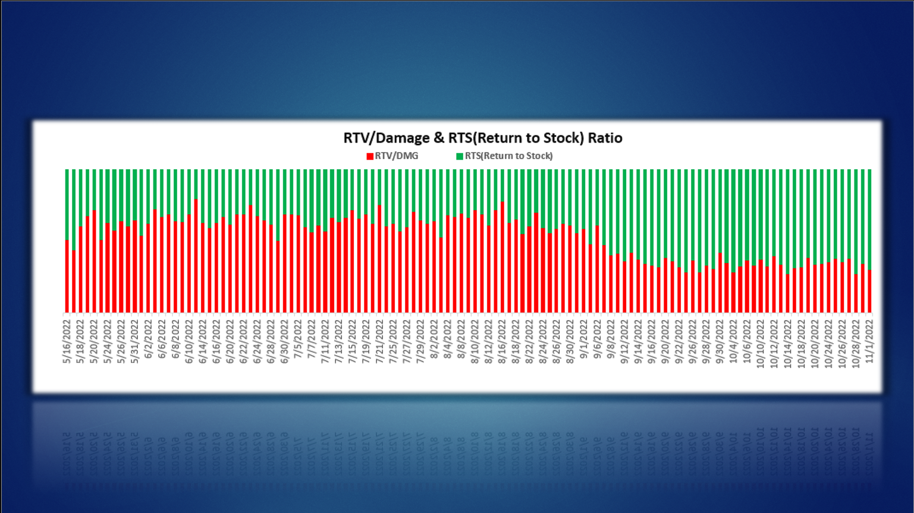
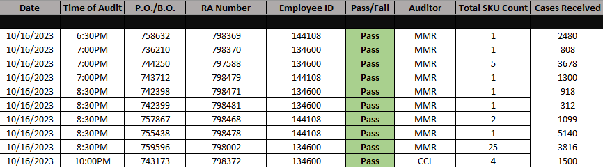
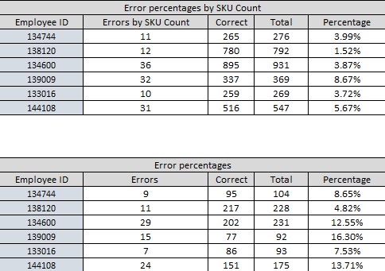
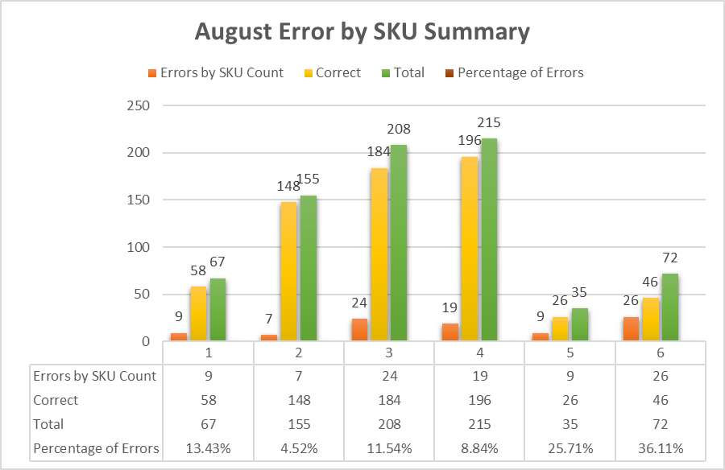
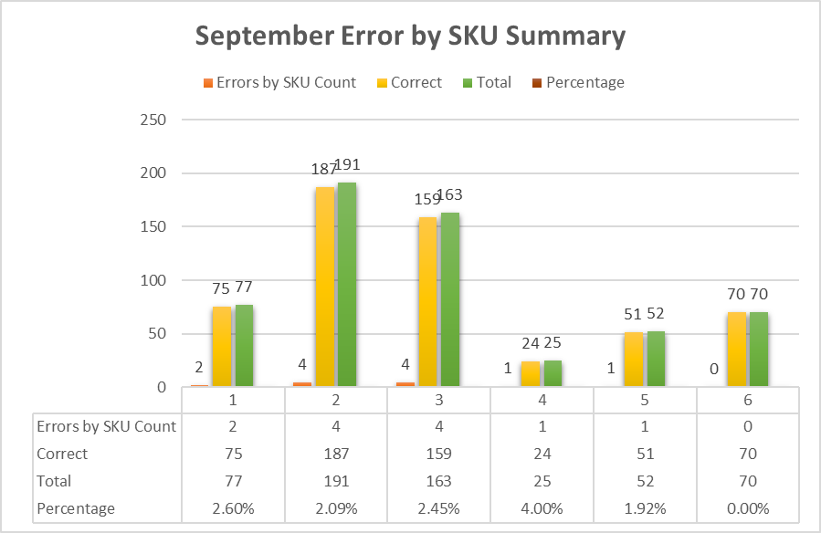
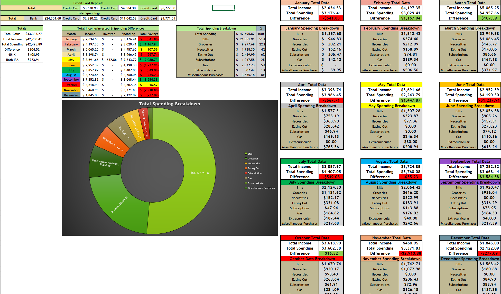
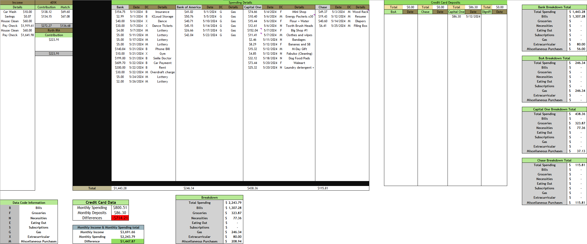
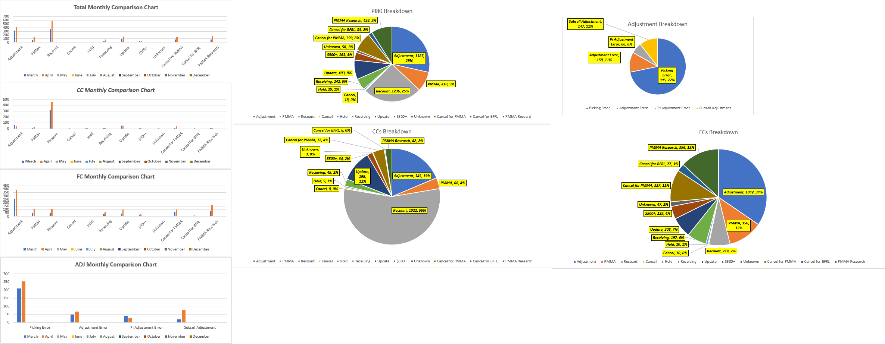

# David's Data Portfolio

## About

Hello! I'm David. I am a strong analytical leader with a background in supply chain, e-commerce, and distribution center environments. I'm currently pursuing an associate degree in computer science/IT, and plan to follow it up with a degree in Data Science. I'm always seeking opportunities to refine and apply my analytical and technical skills.

Outside of work, I relish my role as a father and husband, with a pronounced passion for fitness and finance. I meticulously track both my exercise routines and finances, down to the last penny, reflecting my love for data in all areas of my life. My dream is to turn this passion into a career, and I'm actively working towards making that a reality.

Thank you for visiting. If you have any questions, please don't hesitate to reach out. My contact information is provided below.

### Contact Information
-Linkedin: @DavidCallaway

-Email: Davidcallawaybb@gmail.com

## Work Experience
**Inventory Control Specialist @ Veyer LLC (_December 2023 - Present_)**

-Employed Excel and inventory management software to consistently reconcile inventory levels daily, ensuring data accuracy.

-Implemented a proactive approach to achieve inventory excellence by conducting meticulous data analysis and reporting.

**Inbound Supervisor @ Ollie's Bargain Outlet (_May 2023 - December 2023_)**

-Spearheaded the development and implementation of a new auditing process that resulted in a significant increase in quality percentages.

-Provided personalized constant feedback to receivers, resulting in a decrease in error rates from 22% to less than 1%.

-Managed a team of 44 associates with diverse responsibilities in the receiving and stocking departments.

**Inventory Control Lead @ Bed Bath and Beyond (_January 2021 - May 2023_)**

-Leveraged Excel expertise to identify and resolve $300k in weekly damages.

-Implemented cost-saving processes, reducing expenses by 48% within a 6-month timeframe.

-Enhanced productivity of 25 associates through effective leadership during slotting project.

-Fostered collaboration among inventory control departments to achieve project objectives.

## Portfolio Projects

### Data-Driven Standard Operating Procedure For Processing Damages

During my pursuit of a leadership position at BedBath & Beyond, my senior manager tasked me with assessing and presenting a solution to the warehouse's damage costs. Seizing this opportunity, I created an Excel sheet to catalog our data over a six-month period. It tracked products, the number of units per product, costs, and a ratio of damaged items returned to stock.

After a month of tracking and establishing a baseline for the damage rate, I implemented a standard operating procedure (SOP) for the damage process. This SOP successfully standardized the criteria for considering an item as damaged. It was titled "Crinkle, Wrinkle, Dent", implying that an item with a certain level of these conditions should not be considered damaged.

I conducted one-on-one training for the Returns associates and created multiple visual aids to help distinguish between tolerable conditions and damage. I concluded that the main reason for the $300k worth of damages per week was the inconsistency in damage assessment - everyone had their own opinion.

After the SOP implementation, we began to notice a gradual increase in the damage-to-return-to-stock ratio. A significant cost reduction became apparent, and I used Excel to visually represent this data for the senior leadership team. The presentation was successful, and the procedure was approved for company-wide implementation. This successful experience ignited my passion for using data to improve organizational operations.

### Receiving Audit Report and Process Implementation

The audit report primarily focused on the receiving side of the operation. After clarifying the expectations for the new process, we began to collect data. We promoted an environment of mutual support, addressing and correcting issues before they left the dock.

We typically had 15-20 truckloads of products scheduled daily, each tied to receiving authorizations (RA) and an expected list of contents. However, the actual contents often varied. The receiving process posed numerous technical challenges. All pallets had to adhere to several guidelines: no mixed pallets, the same product per pallet, and confirmed quantity. Each pallet also needed the correct SKU tag for the product. We were thorough during the data collection and auditing processes to ensure quality. This data was then entered into the Receiving Audit Report.

My goal was to provide personalized feedback to each receiver based on their individual weaknesses. To accomplish this, I implemented action codes to identify the types of errors being made. This approach not only helps us discern error patterns, but also allows us to track improvement trends, which we can share with the team on a daily, weekly, and monthly basis. Upon inheriting this role, the overall error rate for all RAs for the team stood at 22%. We aimed to collect our data based on each RA and SKU (unique identifier for the product). Gathering data for RAs with multiple SKUs proved to be both challenging and time-consuming. Below is an example of how this process looked.

Following a period of data collection, we were able to visually represent improvements by comparing set times. The process was well-received and generated positive feedback. Here, we compare data from August to September. Our goal was to audit 90% of all given RAs, which yielded a robust dataset for comparison. By the end of September, the error rate had significantly declined from the initial 22% to consistently below 1%.

 

### Budgeting Towards Financial Freedom

Utilizing Excel as a powerful financial tool, I successfully achieved debt freedom and guided my family towards financial independence. I developed a comprehensive budgeting report that meticulously tracked spending to the last cent and categorized expenditures. This visual representation allowed for clear identification of areas for improvement. My dedication to financial awareness drives me to analyze every dollar spent and implement strategic solutions for financial goals. 

I am passionate about leveraging Excel to enhance financial management and am committed to continuous growth in finance knowledge and discipline. In addition to my financial coaching services, I specialize in creating customized Excel budgeting sheets tailored to individual spending habits. I provide coaching and instruction on how to effectively utilize and maintain these tools. 

I find joy in transforming spending data into tangible solutions that align with clients' goals, while delivering strong visual representations. Below, you will find samples of the summary page and standard monthly data input page that I use to support my financial coaching services.

### Inventory Reconcile Action Reporting 

I developed a daily report to categorize the root causes of variances, using reasoning codes to break down these causes for the senior team. This proactive approach allows for early identification and resolution of issues. The report provides a clear visual representation, enabling the detection of trends over time, the identification of issues, and the provision of appropriate training to rectify these problems.

## Education
-Data Science | Computer Science/IT - North Georiga Tehnical College
 (Expected Graduation: May 2025)
