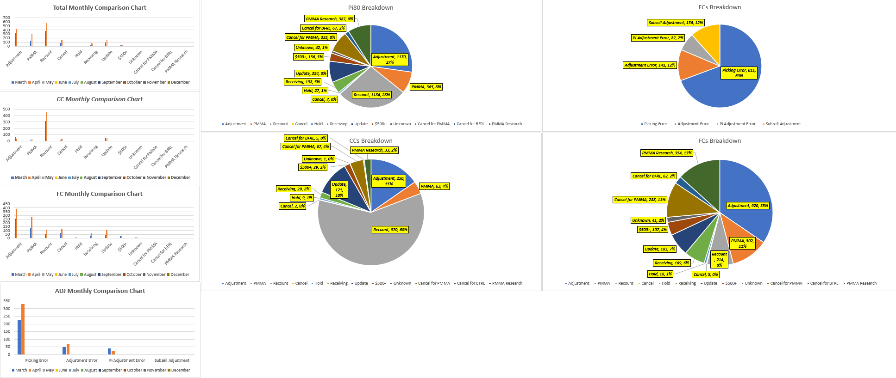

# David Callaway - Data Analyst Portfolio

## About

Hello! I'm David Callaway. I bring to the table a strong background in supply chain, e-commerce, and distribution center environments, all shaped by analytical leadership. I'm currently pursuing an associate degree in computer science/IT, and plan to follow it up with a degree in Data Science. I'm always seeking opportunities to refine and apply my analytical and technical skills.

Outside of work, I relish my role as a father and husband, with a pronounced passion for fitness and finance. I meticulously track both my exercise routines and finances, down to the last penny, reflecting my love for data in all areas of my life. My dream is to turn this passion into a career, and I'm actively working towards making that a reality.

Thank you for visiting. If you have any questions, please don't hesitate to reach out. My contact information is provided below.

### Contact Information
-Linkedin@DavidCallaway
-Email:Davidcallawaybb@gmail.com

### Work Experience
**Inventory Control Specialist @ Veyer LLC (_December 2023 - Present_)**
-Employed Excel and inventory management software to consistently reconcile inventory levels daily, ensuring data accuracy.
-Implemented a proactive approach to achieve inventory excellence by conducting meticulous data analysis and reporting.

**Inbound Supervisor @ Ollie's Bargain Outlet (_May 2023 - December 2023_)**
-Spearheaded the development and implementation of a new auditing process that resulted in a significant increase in quality percentages.
-Provided personalized constant feedback to receivers, resulting in a decrease in error rates from 22% to less than 1%.
-Managed a team of 44 associates with diverse responsibilities in the receiving and stocking departments.

**Inventory Control Lead @ Bed Bath and Beyond (_January 2021 - May 2023_)**
-Leveraged Excel expertise to identify and resolve $300k in weekly damages.
-Implemented cost-saving processes, reducing expenses by 48% within a 6-month timeframe.
-Enhanced productivity of 25 associates through effective leadership during slotting project.
-Fostered collaboration among inventory control departments to achieve project objectives.

## Portfolio Projects
### Data-Driven Standard Operating Procedure For Processing Damages

Spearheaded the development and implementation of a standard operating procedure with the goal to reduce $300k in damages weekly. Utilizing Excel to gather data on a daily basis, I kept track of daily costs, problem-recurring SKUs, trends, damaged and return to stock daily ratios. After a 6 month period I presented the data and results to our senior team, ultimately getting it approved to go company wide starting next quarter.

### Receiving Audit Report and Process Implementation

The audit report primarily focused on the receiving side of the operation. After clarifying the expectations for the new process, we began to collect data. We promoted an environment of mutual support, addressing and correcting issues before they left the dock.

We typically had 15-20 truckloads of products scheduled daily, each tied to receiving authorizations (RA) and an expected list of contents. However, the actual contents often varied. The receiving process posed numerous technical challenges. All pallets had to adhere to several guidelines: no mixed pallets, the same product per pallet, and confirmed quantity. Each pallet also needed the correct SKU tag for the product. We were thorough during the data collection and auditing processes to ensure quality. This data was then entered into the Receiving Audit Report.

My goal was to provide personalized feedback to each receiver based on their individual weaknesses. To accomplish this, I implemented action codes to identify the types of errors being made. This approach not only helps us discern error patterns, but also allows us to track improvement trends, which we can share with the team on a daily, weekly, and monthly basis. Upon inheriting this role, the overall error rate for all RAs for the team stood at 22%. We aimed to collect our data based on each RA and SKU (unique identifier for the product). Gathering data for RAs with multiple SKUs proved to be both challenging and time-consuming. Below is an example of how this process looked.

Following a period of data collection, we were able to visually represent improvements by comparing set times. The process was well-received and generated positive feedback. Here, we compare data from August to September. Our goal was to audit 90% of all given RAs, which yielded a robust dataset for comparison. By the end of September, the error rate had significantly declined from the initial 22% to consistently below 1%.

 

### Inventory Reconcile Action Reporting 

Employed Excel and inventory management software to consistently reconcile inventory levels daily, while utilizing excel to create a visual database dashboard communicating the actions taken to maintain inventory intergrity,

### Finance and Budgeting 

Heres a budgeting report I created as a bonus!

### Education
-Data Analytics | Computer Science/IT - North Georiga Tehnical College
